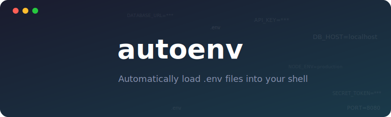

<p align="center">
  
</p>

<p align="center">
  <a href="https://github.com/stormingluke/autoenv/releases/latest"></a>
  <a href="https://github.com/stormingluke/autoenv/actions/workflows/ci.yml"></a>
  
</p>

```bash
# Install from GitHub releases (linux/amd64, macOS/arm64)
curl -fsSL https://raw.githubusercontent.com/stormingluke/autoenv/main/install.sh | bash

# Or install from source (any platform, requires CGO)
CGO_ENABLED=1 go install github.com/stormingluke/autoenv@latest
```

## What it does

`autoenv` registers project directories with `.env` files and automatically manages environment variables as you navigate your filesystem. When you `cd` into a registered project, it exports the environment variables from your `.env` file. When you leave, it unsets them cleanly.

The tool uses shell hooks to detect directory changes, tracks file modifications via SHA-256 hashes (never storing actual secret values), and optionally syncs your project registry across machines using Turso cloud database.

## Features

- **Shell hooks for zsh and bash** - Seamless integration with your existing shell
- **Automatic load/unload on directory change** - Variables appear and disappear as you move between projects
- **Change detection** - Only re-exports when .env file contents change
- **Project switching** - Cleanly unsets old variables before loading new ones
- **Turso embedded replica for cloud sync** - Keep your project registry synchronized across machines
- **GitHub Actions secret sync** - Push .env variables to GitHub Actions secrets via `gh` CLI
- **Configurable defaults** - Store frequently-used settings in the database

## Prerequisites

- **Go 1.25+** (required for building from source)
- **CGO_ENABLED=1** (required - go-libsql uses C bindings)
- **Task runner** (optional, for development tasks): https://taskfile.dev
- **Turso account** (optional, for cloud sync)
- **GitHub CLI `gh`** (optional, for secret sync)

## Installation

### One-line install (recommended)

```bash
curl -fsSL https://raw.githubusercontent.com/stormingluke/autoenv/main/install.sh | bash
```

Installs to `~/.local/bin/` and prints shell setup instructions. Supports **Linux AMD64** and **macOS ARM64**.

### Install from source

```bash
CGO_ENABLED=1 go install github.com/stormingluke/autoenv@latest
```

### Build from source

```bash
git clone https://github.com/stormingluke/autoenv.git
cd autoenv
task build
# or: CGO_ENABLED=1 go build -trimpath -o autoenv .
```

## Quick Start

### 1. Install the shell hook

**Zsh** - add to `~/.zshrc`:

```bash
eval "$(autoenv hook zsh)"
```

**Bash** - add to `~/.bashrc`:

```bash
eval "$(autoenv hook bash)"
```

### 2. Register a project

```bash
eval "$(autoenv load --project /path/to/myproject)"
```

### 3. Verify

```bash
autoenv list
```

### 4. Use it

Now cd into your project directory - .env variables are automatically exported. Leave the directory and they're unset.

## Commands

| Command | Description | Example |
|---------|-------------|---------|
| `autoenv hook <shell>` | Output shell hook code | `eval "$(autoenv hook zsh)"` |
| `autoenv load [-p path]` | Register project and load its .env | `eval "$(autoenv load -p .)"` |
| `autoenv clear` | Unset all loaded vars for current shell | `eval "$(autoenv clear)"` |
| `autoenv list` | List registered projects | `autoenv list` |
| `autoenv configure set <key> <value>` | Set a default | `autoenv configure set github.default_owner stormingluke` |
| `autoenv configure get <key>` | Get a default | `autoenv configure get github.default_owner` |
| `autoenv configure list` | List all defaults | `autoenv configure list` |
| `autoenv sync <target>` | Push .env secrets to GitHub Actions | `autoenv sync github.com/org/repo` |
| `autoenv sync --db` | Force Turso cloud sync | `autoenv sync --db` |

## Configuration

### Environment Variables

| Variable | Description |
|----------|-------------|
| `AUTOENV_CONFIG_DIR` | Override config directory (default: `~/.config/autoenv`) |
| `AUTOENV_TURSO_URL` | Turso database URL for cloud sync |
| `AUTOENV_TURSO_AUTH_TOKEN` | Turso authentication token |
| `AUTOENV_SHELL_PID` | Override shell PID detection (used internally) |

### Data Storage

```
~/.config/autoenv/
├── projects.db    # Project registry + defaults (Turso-synced)
└── sessions.db    # Active shell sessions (local only)
```

Follows XDG Base Directory spec: respects `XDG_CONFIG_HOME` if set.

## Cloud Sync with Turso

When you set `AUTOENV_TURSO_URL` and `AUTOENV_TURSO_AUTH_TOKEN`, your project registry automatically syncs to Turso cloud. The tool uses the embedded replica pattern - data is stored locally first for fast access, then synchronized to the cloud in the background.

Your session state (which shell has which variables loaded) stays local to each machine. Only the project registry is synced.

To force an immediate sync:

```bash
autoenv sync --db
```

## GitHub Actions Secret Sync

The `autoenv sync` command pushes .env variables to GitHub Actions secrets. This requires the `gh` CLI to be installed and authenticated.

```bash
autoenv sync github.com/owner/repo
```

This reads your current project's .env file and creates or updates GitHub Actions secrets for each key-value pair.

Set a default owner to simplify the command:

```bash
autoenv configure set github.default_owner stormingluke
autoenv sync myrepo  # Uses stormingluke/myrepo
```

## Development

```bash
task              # Run lint and test locally
task lint         # Run golangci-lint
task test         # Run tests with race detection
task build        # Build binary
task ci           # Run full Dagger CI pipeline (lint + test + build)
task release      # Verify release via Dagger, tag patch version, push
task release:minor  # Same but bumps minor version
task release:major  # Same but bumps major version
task --list       # See all available tasks
```

### Dagger pipeline

```bash
dagger call all --source=.          # Lint + test + build (linux/amd64)
dagger call lint --source=.         # Just lint
dagger call test --source=.         # Just test
dagger call build --source=.        # Build linux/amd64
```

### Release workflow

`task release` runs the Dagger release pipeline in snapshot mode to verify the build, then tags with an incremented patch version and pushes to main. When the tag reaches GitHub, the CI workflow builds native binaries for both Linux AMD64 and macOS ARM64 and creates a GitHub release.

## Architecture

The codebase uses hexagonal architecture to separate core business logic from external dependencies. For a detailed explanation of the architecture and design decisions, see [docs/GUIDE.md](docs/GUIDE.md).

## License

MIT License - see [LICENSE](LICENSE) file for details.
